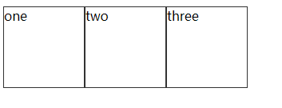
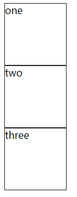
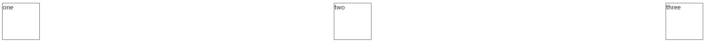
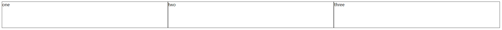
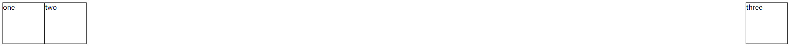
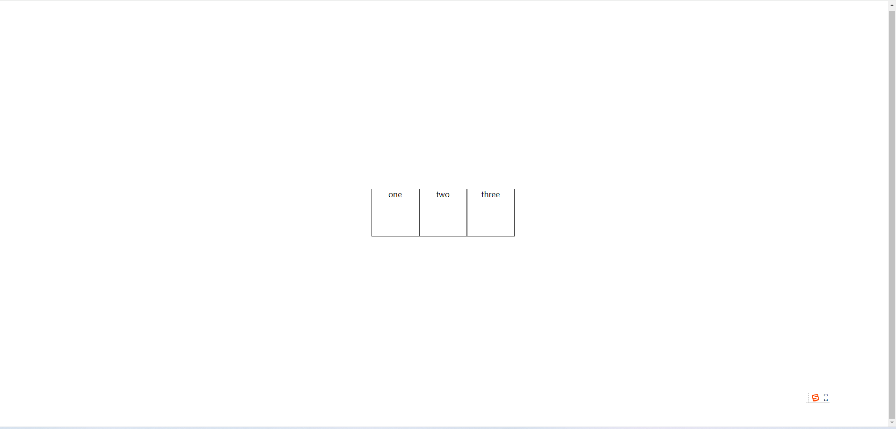
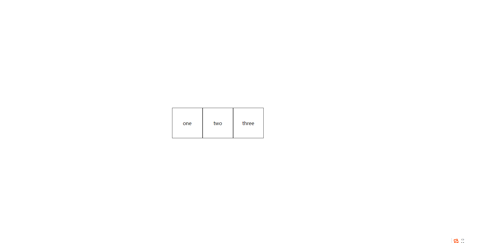

## flex 布局常用属性

### div 不换行

```html
<!DOCTYPE html>
<html lang="en">
  <head>
    <meta charset="UTF-8" />
    <meta name="viewport" content="width=device-width, initial-scale=1.0" />
    <title>Document</title>
  </head>
  <body>
    <div class="box">
      <div class="box__one boder">one</div>
      <div class="box__two boder">two</div>
      <div class="box__three boder">three</div>
    </div>
    <style>
      .box {
        display: flex;
      }
      .boder {
        width: 100px;
        height: 100px;
        border: 1px solid #333;
      }
    </style>
  </body>
</html>
```

效果图：



### div 换行

```html
<!DOCTYPE html>
<html lang="en">
  <head>
    <meta charset="UTF-8" />
    <meta name="viewport" content="width=device-width, initial-scale=1.0" />
    <title>Document</title>
  </head>
  <body>
    <div class="box">
      <div class="box__one boder">one</div>
      <div class="box__two boder">two</div>
      <div class="box__three boder">three</div>
    </div>
    <style>
      .box {
        display: flex;
        flex-direction: column;
      }
      .boder {
        width: 100px;
        height: 100px;
        border: 1px solid #333;
      }
    </style>
  </body>
</html>
```

效果图：



### 平分布局

```html
<!DOCTYPE html>
<html lang="en">
  <head>
    <meta charset="UTF-8" />
    <meta name="viewport" content="width=device-width, initial-scale=1.0" />
    <title>Document</title>
  </head>
  <body>
    <div class="box">
      <div class="box__one boder">one</div>
      <div class="box__two boder">two</div>
      <div class="box__three boder">three</div>
    </div>
    <style>
      .box {
        display: flex;
        justify-content: space-between;
      }
      .boder {
        width: 100px;
        height: 100px;
        border: 1px solid #333;
      }
    </style>
  </body>
</html>
```

效果图：



```html
<!DOCTYPE html>
<html lang="en">
  <head>
    <meta charset="UTF-8" />
    <meta name="viewport" content="width=device-width, initial-scale=1.0" />
    <title>Document</title>
  </head>
  <body>
    <div class="box">
      <div class="box__one boder">one</div>
      <div class="box__two boder">two</div>
      <div class="box__three boder">three</div>
    </div>
    <style>
      .box {
        display: flex;
      }
      .boder {
        width: 100px;
        height: 100px;
        border: 1px solid #333;
        flex: 1;
      }
    </style>
  </body>
</html>
```

效果图：



### 左右布局

```html
<!DOCTYPE html>
<html lang="en">
  <head>
    <meta charset="UTF-8" />
    <meta name="viewport" content="width=device-width, initial-scale=1.0" />
    <title>Document</title>
  </head>
  <body>
    <div class="box">
      <div class="box__one boder">one</div>
      <div class="box__two boder">two</div>
      <div class="box__three boder">three</div>
    </div>
    <style>
      .box {
        display: flex;
      }
      .boder {
        width: 100px;
        height: 100px;
        border: 1px solid #333;
      }
      .box__three {
        margin-left: auto;
      }
    </style>
  </body>
</html>
```

效果图：



### 水平居中

```html
<!DOCTYPE html>
<html lang="en">
  <head>
    <meta charset="UTF-8" />
    <meta name="viewport" content="width=device-width, initial-scale=1.0" />
    <title>Document</title>
  </head>
  <body>
    <div class="box">
      <div class="box__one boder">one</div>
      <div class="box__two boder">two</div>
      <div class="box__three boder">three</div>
    </div>
    <style>
      .box {
        display: flex;
        justify-content: center;
      }
      .boder {
        width: 100px;
        height: 100px;
        border: 1px solid #333;
      }
    </style>
  </body>
</html>
```

效果图：


### div 内文本水平居中

```html
<!DOCTYPE html>
<html lang="en">
  <head>
    <meta charset="UTF-8" />
    <meta name="viewport" content="width=device-width, initial-scale=1.0" />
    <title>Document</title>
  </head>
  <body>
    <div class="box">
      <div class="box__one boder">one</div>
      <div class="box__two boder">two</div>
      <div class="box__three boder">three</div>
    </div>
    <style>
      .box {
        display: flex;
        justify-content: center;
      }
      .boder {
        width: 100px;
        height: 100px;
        border: 1px solid #333;
        display: flex;
        justify-content: center;
      }
    </style>
  </body>
</html>
```

效果图：


### 垂直居中

**设置居中的父盒子需要设置高度**

```html
<!DOCTYPE html>
<html lang="en">
  <head>
    <meta charset="UTF-8" />
    <meta name="viewport" content="width=device-width, initial-scale=1.0" />
    <title>Document</title>
  </head>
  <body>
    <div class="box">
      <div class="box__one boder">one</div>
      <div class="box__two boder">two</div>
      <div class="box__three boder">three</div>
    </div>
    <style>
      .box {
        height: 900px;
        display: flex;
        justify-content: center;
        align-items: center;
      }
      .boder {
        width: 100px;
        height: 100px;
        border: 1px solid #333;
        display: flex;
        justify-content: center;
      }
    </style>
  </body>
</html>
```

效果图：



### div 内文本垂直居中

```html
<!DOCTYPE html>
<html lang="en">
  <head>
    <meta charset="UTF-8" />
    <meta name="viewport" content="width=device-width, initial-scale=1.0" />
    <title>Document</title>
  </head>
  <body>
    <div class="box">
      <div class="box__one boder">one</div>
      <div class="box__two boder">two</div>
      <div class="box__three boder">three</div>
    </div>
    <style>
      .box {
        height: 900px;
        display: flex;
        justify-content: center;
        align-items: center;
      }
      .boder {
        width: 100px;
        height: 100px;
        border: 1px solid #333;
        display: flex;
        justify-content: center;
        align-items: center;
      }
    </style>
  </body>
</html>
```

效果图：


