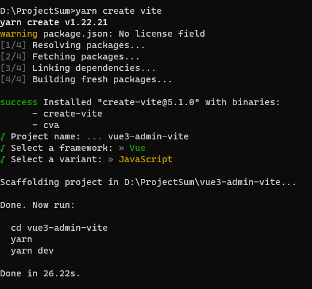
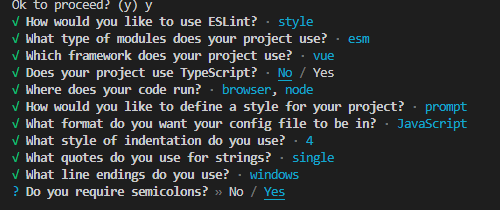
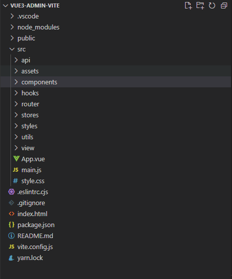

## 搭建 Vite 项目

```
yarn create vite
```



## 安装包

```
yarn add axios element-plus pinia vue-route eslint
```

安装成功之后可在 package.json 看到下载的依赖版本、

```json
{
  "name": "vue3-admin-vite",
  "private": true,
  "version": "0.0.0",
  "type": "module",
  "scripts": {
    "dev": "vite",
    "build": "vite build",
    "preview": "vite preview"
  },
  "dependencies": {
    "axios": "^1.6.2",
    "element-plus": "^2.4.4",
    "eslint": "^8.56.0",
    "pinia": "^2.1.7",
    "vue": "^3.3.11",
    "vue-route": "^1.5.1"
  },
  "devDependencies": {
    "@vitejs/plugin-vue": "^4.5.2",
    "vite": "^5.0.8"
  }
}
```

## 配置 elslint

### 初始化

```
 npx eslint --init
```

选择对应配置，可参考下面的配置，使用空格进行缩进，字符串使用''，语言使用 JavaScript，模块化使用 ES6 的语法



### 修改项目目录

删除 src 下原有的 components 下的 vue 文件，新增一些新的文件夹



### 路由配置

在 router 文件夹下新建 index.js

```javascript
import { createRouter, createWebHistory } from 'vue-router'

const routes = [
  {
    path: '/login',
    name: 'Login',
    component: () => import('@/view/login/index.vue'),
  },
  {
    path: '/:pathMatch(.*)',
    name: '404',
    component: () => import('@/view/404.vue'),
  },
]

const router = createRouter({
  history: createWebHistory,
  routes,
})

export default router
```

在 view 下新建两个 vue 文件

### 封装 axios

先在 utils 文件夹下新建 request.js 文件，在 request 文件中对 axios 进行封装

```javascript
'use strict'

import axios from 'axios'
import { ElMessage } from 'element-plus'
import router from '@/router'

const token = localStorage.getItem('token')

const axiosInstance = axios.create({
  baseURL: '/',
  timeout: 10000,
})

// 根据环境切换路径
if (process.env.NODE_ENV === 'development') {
  axiosInstance.defaults.baseURL = ''
} else if (process.env.NODE_ENV === 'production') {
  axiosInstance.defaults.baseURL = ''
}

/**
 * 防止重复请求思路：
 * 建立一个请求队列，请求队列接收参数：请求的key值和一个控制器
 * 每次请求都在请求拦截里检测key值是否已经存在在请求队列
 * 请求key值：
 * 通过请求的方法，路径，参数进行生成
 */
// 请求队列
const requestQueue = new Map()

// 获取请求key值
const getRequestKey = (config) => {
  let { url, method, data, params } = config

  if (typeof data === 'string') {
    try {
      data = JSON.parse(data)
    } catch (e) {
      throw new Error(e)
    }
  }
  const requestStr = `${method}_${url}_${
    params ? JSON.stringify(params) : JSON.stringify(data)
  }`
  // // 设置请求key 通过md5加密
  const requestKey = btoa(
    encodeURIComponent(requestStr).replace(
      /%([0-9A-F]{2})/g,
      function (match, p1) {
        // return String.fromCharCode(p1);
        return String.fromCharCode(parseInt('0x' + p1))
      }
    )
  )

  return requestKey
}

// 关闭全部请求
const cancelAllRequest = () => {
  requestQueue.forEach((controller) => {
    controller.abort()
  })

  requestQueue.clear()

  return 'ok'
}

// 请求拦截
axiosInstance.interceptors.request.use(
  (config) => {
    if (token) {
      config.headers.Authorization = 'Bearer ' + token
    }

    const requestKey = getRequestKey(config)

    const controller = new AbortController()

    config.signal = controller.signal

    if (requestQueue.has(requestKey)) {
      controller.abort()
    } else {
      requestQueue.set(requestKey, controller)
    }

    return config
  },
  (error) => {
    error.data = {
      code: 500,
      message: '接口错误',
    }
    return Promise.reject(error)
  }
)

// 响应拦截
axiosInstance.interceptors.response.use(
  (response) => {
    const config = response.config

    const requestKey = getRequestKey(config)

    requestQueue.delete(requestKey)

    // const { restoreDataFormat = true, successText, errorText } = config;
    const { statusCode: code, msg, data } = response.data

    // console.log(response,"code");
    if (code === 401) {
      cancelAllRequest()

      // 跳转回登录页
      router.push({
        path: '/login',
      })
    }

    if (code === 20000 || response.status === 200) {
      ElMessage({
        message: '请求成功',
        type: 'success',
      })
    } else {
      ElMessage({
        message: '请求错误',
        type: 'error',
      })

      return Promise.reject(msg)
    }

    if (!data) {
      return response
    }

    return data
  },
  (error) => {
    const config = error.config

    if (error.message.indexOf('timeout') !== -1) {
      ElMessage({
        message: '请求超时',
        type: 'error',
      })
    }

    if (error.message.indexOf('timeout') !== -1 && config.method === 'get') {
      const requestKey = getRequestKey(config)

      requestQueue.delete(requestKey)
    }

    if (error.response.status) {
      switch (error.response.status) {
        case 401:
          ElMessage({
            message: '未授权，请重新登录',
            type: 'error',
          })
          // 重定向回登录页
          break
        case 403:
          ElMessage({
            message: '拒绝访问',
            type: 'error',
          })
          // 清除token
          break
        case 404:
          ElMessage({
            message: '请求错误，未找到该资源',
            type: 'error',
          })
          break
        default:
          ElMessage({
            message: '请求错误',
            type: 'error',
          })
      }
    }
    return Promise.reject(error)
  }
)
```

### api 统一导出
