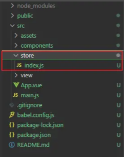

# 1、什么是 Vuex？

在使用 vue 作为框架的前端项目开发中，我们经常会碰到 Vuex，那么 Vuex 到底是什么东西呢？

根据官方文档给出的解释是：**Vuex 是一个专为 Vue.js 应用程序开发的状态管理模式 + 库。它采用集中式存储管理应用的所有组件的状态，并以相应的规则保证状态以一种可预测的方式发生变化。**

简单来说，Vuex 就是一个状态管理的库，或者说是一个用来存放组件公共数据的仓库。

# 2、为什么要使用 Vuex

要了解为什么要使用 Vuex，那么我们就需要先来了解 vue 项目中组件之间的传参方式

## 2.1、组件之间的传参方法

父组件向子组件传参：

```html
// 父组件传递参数
<template>
  <!-- 引入子组件 -->
  <son :fatherData="fatherData"></son>
</template>

<script>
  import Son from './son.vue'
  export default {
    components: {
      Son,
    },
    data() {
      return {
        fatherData: '父组件的数据',
      }
    },
  }
</script>

// 子组件接收参数
<template>
  <div>{{ fatherData }}</div>
</template>

<script>
  export default {
    // 接收父组件传递的值
    props: {
      fatherData: {
        type: String,
        required: true,
      },
    },
  }
</script>
```

子组件向父组件传参：

```html
// 父组件
<template>
  <!-- 引入子组件 -->
  <div>
    <son @getData="getSonData"></son>
    <div>{{sonData}}</div>
  </div>
</template>

<script>
  import Son from './son.vue'
  export default {
    components: {
      Son,
    },
    data() {
      return {
        sonData: '',
      }
    },
    methods: {
      // 自定义的调用方法的参数就是子组件传递过来的数据
      getSonData(value) {
        this.sonData = value
      },
    },
  }
</script>

// 子组件
<template>
  <div>
    <button @click="toFather">子向父传参</button>
  </div>
</template>

<script>
  export default {
    data() {
      return {
        sonData: '子组件的数据',
      }
    },
    methods: {
      // 使用$emit来触发父组件中的自定义事件，将子组件的数据通过$emit传递给父组件
      toFather() {
        this.$emit('getData', this.sonData)
      },
    },
  }
</script>
```

组件之间跳转的传参方法（示例由组件 A 跳转到组件 B）：

```html
// A组件
<template>
  <button @click="toB">跳转到B页面</button>
</template>

<script>
  export default {
    data() {
      return {
        aData: 'A页面的数据',
      }
    },
    methods: {
      toB() {
        // 在页面跳转时，通过query传递数据
        this.$router.push({
          path: '/B',
          query: { aData: this.aData },
        })
      },
    },
  }
</script>

// B组件
<template>
  <div>{{ bData }}</div>
</template>

<script>
  export default {
    data() {
      return {
        bData: '',
      }
    },
    created() {
      this.bData = this.$route.query.aData
    },
  }
</script>
```

从上面三种组件之间传参的方式我们可以看出，组件与组件之间传递参数实现数据共享，那么组件之间需要有一定联系，要么是父子组件，要么是有跳转的关系，才能实现数据的共享。可是在完全没有联系的组件之间，他们如何实现数据的共享呢？

要想实现完全没有联系的组件之间数据共享，我们需要先思考一个问题，什么样的数据，需要同时在几个没有联系的组件中去使用呢？

## 2.2、 数据共享的情景

在项目开发中，我们经常会碰到一种情景，比如说一个系统，在用户登录之后，后端会将该用户的一些数据返回给前端，如用户名，token 等，而这些用户数据往往不止在一个页面中使用，可能涉及到多个相互没有联系的组件，那么在这种时候，我们就需要使用到 Vuex。

# 3、Vuex 的使用

对于一个插件的使用，我们首先需要看对应的官方文档：[Vuex 是什么？ | Vuex (vuejs.org)](https://vuex.vuejs.org/zh/)。根据文档，接下来我们来一起理解 Vuex。

在 Vuex 中有五个属性，分别为 state，getters，mutations，actions，modules，下面我们将从这五个属性来学习 Vuex。

## 3.1、state 属性：

从上面的概念我们知道，Vuex 是用来存放一些共享的数据，实现状态管理的一个插件，那么，我们的这些数据要放在那里呢？

在项目目录下，我们可以找到一个名为 store 的文件夹，文件夹中存放一个 index.js 的文件



我们之后关于 Vuex 的一些操作，基本都会在这个文件夹下的文件中实现。

首先我们来看一下 index.js 文件中都有些什么

```js
// 导入vue
import Vue from 'vue'
// 导入Vuex
import Vuex from 'vuex'
// 注册Vuex组件
Vue.use(Vuex)

// 导出Vuex.Store
export default new Vuex.Store({
  state: {},
  getters: {},
  mutations: {},
  actions: {},
  modules: {},
})
```

我们可以看到，index.js 中的内容基本和其他的插件的使用方式一样，我们主要看 Vuex.Store 中的内容，我们可以看到前面讲到的五个属性就是在 Vuex.Store 中，而我们的数据，就会放在 state 中。那么，怎么使用这个数据呢，我们使用文档中举的例子来示例。

首先，我们需要在 state 中加入我们要在其他组件中使用的数据

```js
// store/index.js
export default new Vuex.Store({
  state: {
    // 添加一个变量num
    num: 0,
  },
})
```

在 store 中添加了数据之后，我们需要到对应的组件中使用

组件 A 中使用

```html
<template>
  <div>{{$store.state.num}}</div>
</template>
```

组件 B 中使用

```html
<template>
  <div>{{num}}</div>
</template>

<script>
  import { mapState } from 'vuex'
  export default {
    computed: {
      ...mapState(['num']),
    },
  }
</script>
```

在这里我举例了两种组件调用 state 中数据的方法，文档中还提到了其他的方法，可以自行查看。

到这里我们发现，我们已经实现了将数据存放在一个地方，可以供多个不相关的组件一起调用，那么好像数据共享就完成了一部分，但是我们也知道，前端的数据往往不是单纯地进行展示，而是需要进行操作，那么，对于 Vuex 中的数据，我们要怎么进行操作呢？

按照前端开发的思路，原则上只要我们获取到数据，好像就可以对数据进行操作了，我们既然通过$store.state.num可以获取到num，那么对$store.state.num 进行操作就可以了，按这个思路，我们可以看看是否成功？

```html
<template>
  <button @click="add">num加一</button>
</template>

<script>
  export default {
    methods: {
      add() {
        this.$store.state.num++
      },
    },
  }
</script>
```

通过试验，我们发现，页面展示的数据确实达到了想要的效果，但是通过 Vue 开发者工具，我们发现，Vuex 的 state 一直都没有改变


很显然，我们不能直接通过$store.state.num 来改变数据，那么我们到底需要怎么样改变数据呢？

## 3.2、mutations 属性：

通过看 Vuex 的文档，我们可以在 mutations 属性介绍中发现这样一句话：**更改 Vuex 的 store 中的状态的唯一方法是提交 mutation**。那么根据这句话，我们就可以知道，想要修改 num，必须提交 mutation，根据文档的使用方法，我们更改一下代码：

```html
<template>
  <button @click="add">num加一</button>
</template>

<script>
  export default {
    methods: {
      add() {
        this.$store.commit('addNum')
      },
    },
  }
</script>
```

```js
// store/index.js
export default new Vuex.Store({
  state: {
    // 添加一个变量num
    num: 0,
  },
  mutations: {
    addNum(state) {
      state.num++
    },
  },
})
```

结果也符合预期：


那么到这里，数据的展示和操作好像都已经完成了，可是我们发现，还有三个属性都没有用到，那么这三个属性又有什么样的用处呢？

## 3.3、actions 属性：

我们知道，在实际的项目开发中，我们会碰到很多异步操作，比较常见的就用 axios 请求，定时器等，那么我们对 Vuex 中的数据进行异步操作时是不是还是使用 mutations 呢？

很显然，大家看目录到这里，就知道对 Vuex 中的数据进行异步操作是要用到 actions 的，但是我们在学习 mutations 的时候有了解到**更改 Vuex 的 store 中的状态的唯一方法是提交 mutation**，那么 actions 是如何提交 mutation 的呢？

```js
export default new Vuex.Store({
  state: {
    // 添加一个变量num
    num: 0,
  },
  mutations: {
    addNum(state) {
      state.num++
    },
  },
  actions: {
    addNum(context) {
      setTimeout(() => {
        context.commit('addNum')
      }, 1000)
    },
  },
})
```

```html
<template>
  <div>
    <button @click="add">num加一</button>
    <button @click="delayed">延时加1</button>
  </div>
</template>

<script>
  export default {
    methods: {
      add() {
        this.$store.commit('addNum')
      },
      delayed() {
        this.$store.dispatch('addNum')
      },
    },
  }
</script>
```

我们可以看到在 action 中，有一个 addNum 方法接收了一个 context 参数，然后再方法中有一个定时器，定时器中通过 conntext.commit 调用了 addNUm，看到.commit 我们就会看到调用 mutations 时用的就是**this.$store.commit('addNum')，** 那是不是达标，action 接收的那个 context 参数就是 this.$store呢？我们使用console.log分别输出this.$store 和 context


在控制台中，我们可以看到，这两者有类似的属性，但是又不完全相同，但是，两者都有着同样的方法，那么就有可能是，context 与 store 存在着某些联系，可以通过 context.commit 提交 mutations。根据文档给出的解释是，Action 函数接收了一个与 store 实例具有相同方法和属性的 context 对象，使我们可以通过 context.commit 来提交 mutations。

## 3.4、modules 属性：

modules 的中文意思是模块，那么见名思意，我们可以大致理解为 modules 属性就是用来存放模块的。那么，在存放模块之前，就意味着我们需要现有模块。

在 Vuex 中，是允许我们将 store 分割成模块，每个模块拥有自己的 state,mutations,action,getters 甚至是 modules,那么我们想象一下，为什么我们需要将 store 分割成模块呢？

我们知道，组件化开发，可以将根据功能划分组件，然后再讲组件整合在一起，这样既有利于我们分工，也增加了代码的复用性和便于后期的维护。而将 store 显然也是出于这样的考虑，我们知道，在一个大型的项目，需要进行状态管理的数据往往不是一两个变量，而是一个很复杂庞大的数据，如果我们将这些数据全部写到 index.js 文件中，那么整个文件就会显得冗余，而是可读性很低，那么这时候就需要我们将这些数据分割成不同的模块。


```js
// store/index.js
export default new Vuex.Store({
  state: {},
  mutations: {},
  actions: {},
  modules: {
    user,
    menu,
    tab,
  },
})
```

例如这样，我们就可以根据我们的需要，将 user 和 menu 的数据分割成一个模块，这样 store/index.js 这个文件就会显得很精简，而且也便于我们的更改。

## 3.5、getters 属性：

getters 这个属性主要用于对 state 中的数据进行一些数据处理，在某种程度上来说，比较像组件中的 computed。这里的数据处理和上面的 mutations 的数据操作并不是同一个意思。

getters 的数据数据处理是指将 state 处理之后在组件中展示，而 mutations 则是指在触发某些事件之后对数据进行对应的操作。

举个例子，我们现在 state 中的 num 是 0，我们知道在点击事件提交 mutations 之后 num 会加 1，但是我们现在希望在增加多一个变量的前提下，组件 A 展示的是 1，组件 B 展示的是 0，那么在这个时候，我们就需要用到 getters 对 state 的 num 进行数据处理

```js
export default new Vuex.Store({
  state: {
    // 添加一个变量num
    num: 0,
  },
  getters: {
    getAddNum(state) {
      return state.num + 1
    },
  },
  mutations: {
    addNum(state) {
      state.num++
    },
  },
  actions: {
    addNum(context) {
      console.log('context', context)
      setTimeout(() => {
        context.commit('addNum')
      }, 1000)
    },
  },
})
```

组件 A：

```html
<template>
  <div>{{$store.getters.getAddNum}}</div>
</template>
```

这样，我们就可以达成我们的目的：


# 4、总结

Vuex 的使用还有很多需要注意的地方，本文只是简单的理解 Vuex 的几个属性的使用方法。

需要注意的地方是：由于 Vuex 的版本升级，很多地方进行了修正（详情可以查看官方文档），本文的代码是基于"vuex": "^3.4.0"版本的，如果按本文的代码练习出现错误，请寻找对应的 Vuex 版本代码进行学习。

**参考资料**

[vue 子组件怎么向父组件传值-Vue.js-PHP 中文网](https://www.php.cn/vuejs/480569.html)

[Vuex 之理解 Getters 的用法\_面条请不要欺负汉堡的博客-CSDN 博客\_getters](https://blog.csdn.net/gao_xu_520/article/details/79694148)

[简单快速撸懂 vuex\_哔哩哔哩\_bilibili](https://www.bilibili.com/video/BV1dp4y1S7G6?spm_id_from=333.337.search-card.all.click)
