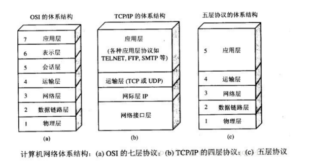
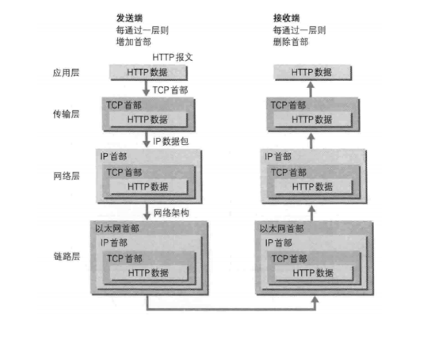
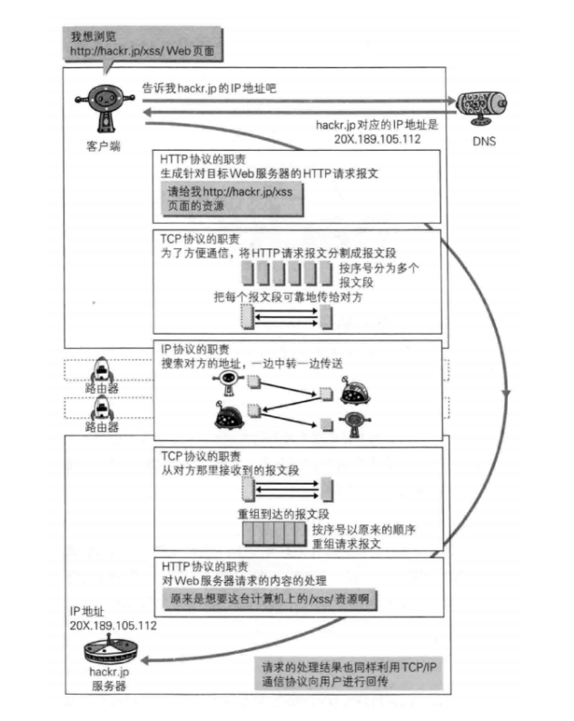

# 计网

## 五层结构

把与互联网相关联的协议集合起来总称为 TCP/IP。TCP/IP 协议族里重要的一点就是 分层。TCP/IP 协议族按层次分别分为以下 4 层：应用层、传输层、网络层和数据链路层。

把 TCP/IP 层次化是有好处的。比如，如果互联网只由一个协议统筹，某个地方需 要改变设计时，就必须把所有部分整体替换掉。而分层之后只需把变动的层替换掉即可。把各层之间的接口部分规划好之后，每个层次内部的设计就能够自由改动了。

## 应用层

应用层(application-layer)的任务是通过应用进程间的交互来完成特定网络应用。应 用层协议定义的是应用进程（(进程：主机中正在运行的程序)间的通信和交互的规 则。对于不同的网络应用需要不同的应用层协议。在互联网中应用层协议很多，如 域名系统 DNS，支持万维网应用的 HTTP 协议，支持电子邮件的 SMTP 协议等等。我 们把应用层交互的数据单元称为报文。

## 运输层

运输层(transport layer)的主要任务就是负责向两台主机进程之间的通信提供通 用的数据传输服务。应用进程利用该服务传送应用层报文。“通用的”是指并不针对某 一个特定的网络应用，而是多种应用可以使用同一个运输层服务。由于一台主机可 同时运行多个线程，因此运输层有多路复用和多路分解的功能。所谓多路复用就是 指多个应用层套接字可同时使用下面运输层的服务，多路分解是运输层把收到的信 息分别交付上面应用层中的相应套接字。

运输层主要使用以下两种协议：

1．传输控制协议 TCP(Transmission Control Protocol)--提供面向连接的，可靠的数 据传输服务。

2．用户数据协议 UDP (User Datagram Protocol)--提供无连接的，尽最大努力的数 据传输服务(不保证数据传输的可靠性)。

## 网络层

在计算机网络中进行通信的两个计算机之间可能会经过很多个数据链路，也可 能还要经过很多通信子网。网络层的任务就是选择合适的网间路由和交换结点，确 保数据及时传送。在发送数据时，网络层把运输层产生的报文段或用户数据报封装 成分组和包进行传送。在 TCP/IP 体系结构中，由于网络层使用 IP 协议，因此分组也 叫 IP 数据报，简称数据报。

## 链路层

两台主机之间的数据传输，总是在一段一段的链路上传送的，这就需要使用专 门的链路层的协议。在两个相邻节点之间传送数据时，数据链路层将网络层交下来 的 IP 数据报组装成帧，在两个相邻节点间的链路上传送帧。每一帧包括数据和必要 的控制信息(如同步信息，地址信息，差错控制等)。在接收数据时，控制信息使接收 端能够知道一个帧从哪个比特开始和到哪个比特结束。这样，数据链路层在收到一 个帧后，就可从中提出数据部分，上交给网络层。控制信息还使接收端能够检测到 所收到的帧中有误差错。如果发现差错，数据链路层就简单地丢弃这个出了差错的 帧，以避免继续在网络中传送下去白白浪费网络资源。如果需要改正数据在链路层 传输时出现差错（这就是说，数据链路层不仅要检错，而且还要纠错)，那么就要采 用可靠性传输协议来纠正出现的差错。这种方法会使链路层的协议复杂些。

## 物理层

在物理层上所传送的数据单位是比特。物理层(physical layer)的作用是实现相邻计 算机节点之间比特流的透明传送，尽可能屏蔽掉具体传输介质和物理设备的差异。 使其上面的数据链路层不必考虑网络的具体传输介质是什么。“透明传送比特流"表示 经实际电路传送后的比特流没有发生变化，对传送的比特流来说，这个电路好像是 看不见的。

https://blog.csdn.net/yaopeng_2005/article/details/7064869

## 数据封装过程

首先作为发送端的客户端在应用层(HTTP 协议)发出一个想看某个 Web 页面的 HTTP 请求。接着，为了传输方便，在传输层(TCP 协议）把从应用层处收到的数据 (HTTP 请求报文)进行分割，并在各个报文上打上标记序号及端口号后转发给网络 层。 在网络层（IP 协议），增加作为通信目的地的 MAC 地址后转发给链路层。这样 一来，发往网络的通信请求就准备齐全了。 接收端的服务器在链路层接收到数据，按序往上层发送，一直到应用层。当传 输到应用层，才能算真正接收到由客户端发送过来的 HTTP 请求。

# HTTP

## http 常见的状态码类型其作用

**1xx**

1xx 类状态码属于提示信息，是协议处理中的一种中间状态，实际用到的比较少。

**2xx**

2xx 类状态码表示服务器成功处理了客户端的请求，也是我们最愿意看到的状 态。

「200 OK」是最常见的成功状态码，表示一切正常。如果是非 HEAD 请求，服务器 返回的响应头都会有 body 数据。

「204 No Content」也是常见的成功状态码，与 200 OK 基本相同，但响应头没有 body 数据。

「206 Partial Content」是应用于 HTTP 分块下载或断电续传，表示响应返回的 body 数据并不是资源的全部，而是其中的一部分，也是服务器处理成功的状态。

**3xx**

3xx 类状态码表示客户端请求的资源发送了变动，需要客户端用新的 URL 重新发送 请求获取资源，也就是重定向。

「301 Moved Permanently」表示永久重定向，说明请求的资源已经不存在了， 需改用新的 URL 再次访问。

「302 Moved Permanently」表示临时重定向，说明请求的资源还在，但暂时需 要用另一个 URL 来访问。 301 和 302 都会在响应头里使用字段 Location ，指明后续要跳转的 URL，浏览器 会自动重定向新的 URL。

「304 Not Modified」不具有跳转的含义，表示资源未修改，重定向已存在的缓冲 文件，也称缓存重定向，用于缓存控制。

**4xx**

4xx 类状态码表示客户端发送的报文有误，服务器无法处理，也就是错误码的含 义。

「400 Bad Request」表示客户端请求的报文有错误，但只是个笼统的错误。 「403 Forbidden」表示服务器禁止访问资源，并不是客户端的请求出错。

「404 Not Found」表示请求的资源在服务器上不存在或未找到，所以无法提供给 客户端。

**5xx**

5xx 类状态码表示客户端请求报文正确，但是服务器处理时内部发生了错误，属于 服务器端的错误码。

「500 Internal Server Error」与 400 类型，是个笼统通用的错误码，服务器发生 了什么错误，我们并不知道。

「501 Not Implemented」表示客户端请求的功能还不支持，类似“即将开业，敬 请期待”的意思。

「502 Bad Gateway」通常是服务器作为网关或代理时返回的错误码，表示服务器 自身工作正常，访问后端服务器发生了错误。

「503 Service Unavailable」表示服务器当前很忙，暂时无法响应服务器，类似 “网络服务正忙，请稍后重试”的意思。
